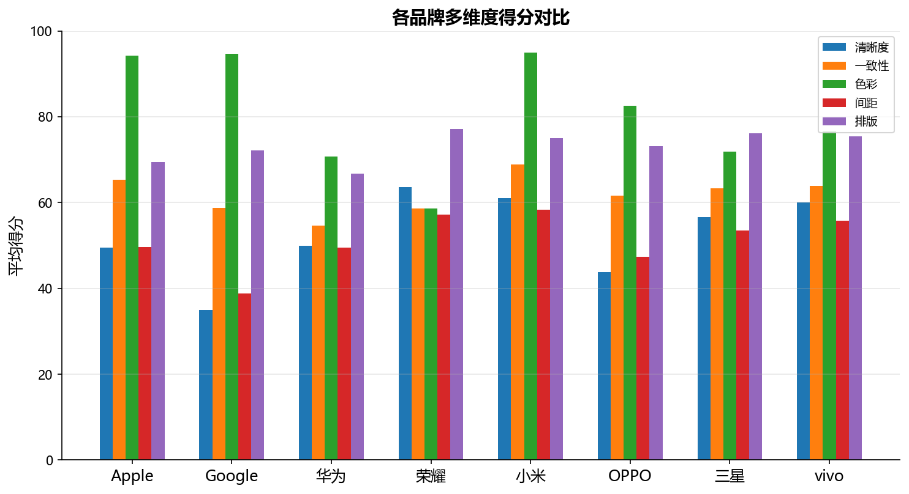
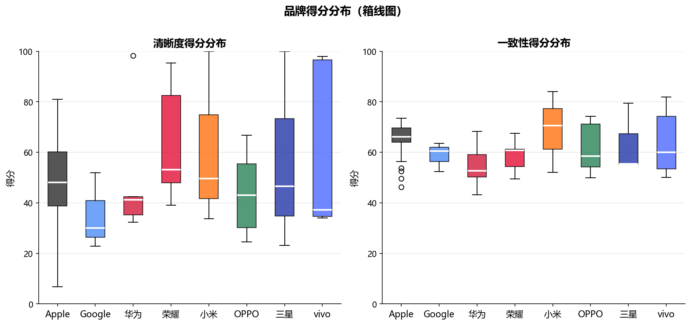
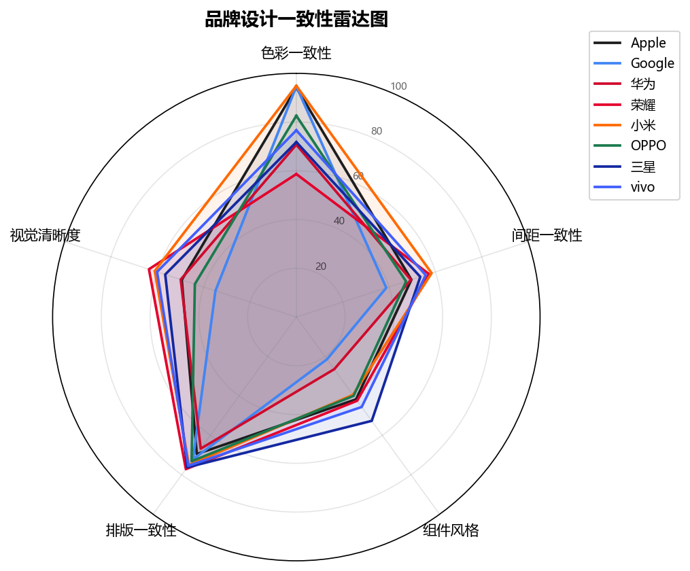
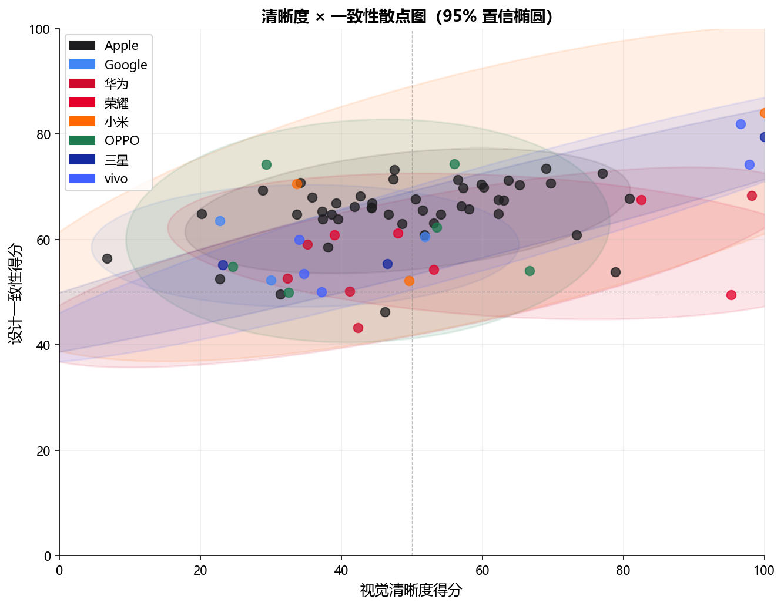

# Apple Consistency Evaluator
> 多品牌 UI 设计一致性评测系统 — 工业设计专业"信息与交互"课程个人作业

**GitHub Pages 在线体验：** https://dingzhen-zhr.github.io/apple-consistency-evaluator/

---

## 目录

1. [项目背景与动机](#1-项目背景与动机)
2. [核心问题定义](#2-核心问题定义)
3. [评测方法论](#3-评测方法论)
4. [五维度算法详解](#4-五维度算法详解)
5. [评级系统](#5-评级系统)
6. [品牌对比分析](#6-品牌对比分析)
7. [如何解读分析报告](#7-如何解读分析报告)
8. [系统架构与技术实现](#8-系统架构与技术实现)
9. [本地运行指南](#9-本地运行指南)
10. [与同学方案的对比与借鉴](#10-与同学方案的对比与借鉴)
11. [局限性与未来工作](#11-局限性与未来工作)
12. [参考文献](#12-参考文献)

---

## 1 项目背景与动机

### 1.1 为什么"设计一致性"重要

在数字产品设计中，**视觉一致性（Visual Consistency）** 是品牌可信度与用户体验的基础。当一个 App 的按钮圆角忽大忽小、行间距前后不一、配色体系混乱时，用户会下意识感受到"粗糙感"，即便单个界面看起来足够精美。  

苹果公司（Apple）的 **Human Interface Guidelines（HIG）** 是移动端 UI 规范的黄金标准之一，其系统性地规定了色彩使用规则、间距栅格、字体层级等约束，使得 iOS 系统应用在数十年迭代中始终保持强烈的视觉统一感。  

然而，**设计一致性的评价长期依赖专家主观判断**——设计师凭借经验审核稿件，耗时费力，且难以量化和复现。本项目的核心问题就是：

> **能否用纯计算机视觉方法，在无需标注数据、无需深度学习模型的前提下，将 UI 截图的设计一致性自动量化评分？**

### 1.2 以 Apple HIG 为锚点的意义

选择 Apple HIG 作为评测锚点并非仅因其权威性，更因为它足够**可操作化**：
- 规定了 4pt 为最小间距单元，8pt 栅格为基准，易于用 Hough 变换检测
- 规定了特定圆角半径区间，适合轮廓分析
- San Francisco 字体体系有清晰的三级字号层级（标题/正文/辅助），适合 MSER 检测分层
- Apple 自身的截图可以作为"高分参考集"验证算法

---

## 2 核心问题定义

### 2.1 评测对象

- **输入**：任意 UI 截图（PNG / JPEG / WEBP，推荐 1× 逻辑像素分辨率，≥ 375px 宽）
- **评测标准**：与 Apple HIG 规范的符合程度
- **输出**：多维度量化得分（0–100）、等级（S/A/B/C/D）、具体问题列表、AI 文字解读

### 2.2 评测的两个独立维度

本系统将 UI 质量分解为两个相对独立的轴，各自回答不同的问题：

| 轴 | 问题 | 含义 |
|---|---|---|
| **X轴 · 视觉清晰度（Clarity）** | "这张图像本身清不清晰？" | 图像信噪比、边缘锐度、对比度 |
| **Y轴 · 设计一致性（Consistency）** | "设计规范执行得一不一致？" | 五维度加权合成 |

两轴**互不包含**：一张清晰度极高的 UI 截图，可能因为风格混乱而一致性得分很低；反过来，一张轻微模糊的截图，其设计规范执行也可能非常严谨。

**综合得分公式：**

$$\text{Overall} = 0.4 \times \text{Clarity} + 0.6 \times \text{Consistency}$$

一致性权重（0.6）高于清晰度（0.4），因为设计规范的一致执行对用户体验的影响更持久、更本质。

---

## 3 评测方法论

### 3.1 双轴坐标系设计

所有分析结果都可以映射到一个二维坐标系中（详见第6节散点图）：

```
100 ┬──────────────────────────────────
    │           A区                S区
    │    设计严谨但图质略差   完美
 一  │
 致  50 ┤──────────── 平均线 ────────────
 性  │
    │    粗糙不清晰           清晰但混乱
    │           D区                C区
  0 ┴──────────────────────────────────
    0          50              100
                  清晰度
```

"S 级"区域是清晰度与一致性双高的理想状态，也是 Apple 系统应用的主要聚集区。

### 3.2 一致性五维度权重设计

| 维度 | 权重 | 权重设计理由 |
|---|---|---|
| **色彩一致性** | 0.25 | 色彩是用户感知中最直觉、最先注意到的维度；配色混乱最显眼 |
| **间距/栅格一致性** | 0.25 | 间距规律性是 HIG 最核心的规范之一（8pt 栅格）；影响整洁感 |
| **组件风格一致性** | 0.20 | 圆角、形状统一是品牌识别度的关键，但信息量略低于前两项 |
| **排版一致性** | 0.15 | 字级层级重要，但在截图中 MSER 检测噪声较大，可靠性略低 |
| **视觉律动感** | 0.15 | 新维度，尚处于验证阶段，保守赋权 |

### 3.3 分析流水线

```
图像上传
    │
    ▼
图像预处理（降噪、归一化、多尺度缩放）
    │
    ├──► ColorConsistencyAnalyzer      ─┐
    ├──► SpacingGridConsistencyAnalyzer ├── 并行执行，各自输出 features + issues
    ├──► ComponentStyleAnalyzer        │
    ├──► TypographyAnalyzer            │
    └──► VisualRhythmAnalyzer          ─┘
                │
                ▼
        score_from_features()  ← 加权合成双轴得分
                │
                ▼
        compute_grade()        ← 映射 S/A/B/C/D
                │
                ▼
        enrich_with_submetrics() ← 注入子指标说明、公式、解读
                │
                ▼
        DeepSeek AI 解读（异步，可选）
                │
                ▼
        返回 AnalysisResult JSON
```

---

## 4 五维度算法详解

### 4.1 色彩一致性（ColorConsistency）

**衡量什么：** 界面主色系是否克制统一，有无杂乱的配色冲突。

**为什么用 K-Means：** 人眼对色彩的感知具有天然的"簇聚"特性——我们谈论"主色调"而非所有像素的独立分布。K-Means（k=8）恰好模拟了大多数成熟设计系统的色彩架构（通常 2–4 个主色 + 几个辅助色 + 背景色）。

**算法步骤：**
1. 将图像降采样至 200×200 像素（减少计算量，不影响色彩分布特征）
2. 将 RGB 像素转换到 **CIELAB 色彩空间**（Lab）——Lab 的欧氏距离更接近人眼对色差的感知
3. 对 Lab 像素运行 K-Means（k=8），得到 8 个聚类中心
4. 计算聚类中心之间的色差方差 
   $$
   \sigma_{\text{Lab}}
   $$
   

$$
\text{score} = 100 \times \left(1 - \frac{\sigma_{\text{Lab}}}{\sigma_{\max}}\right), \quad \sigma_{\max} = 50
$$


5. 额外检测：若存在色差 $\Delta E > 40$ 的高对比色对（可能是设计风格突变或错误），生成 `medium` 级别问题

**解读：**
- **80–100 分**：主色系高度统一，符合单一品牌调性（如 Apple 的白/灰/蓝）
- **50–80 分**：有主色调但存在若干辅助色分散，常见于功能较复杂的应用
- **< 50 分**：配色混乱，无清晰的色彩系统，或存在大量无关装饰图片

### 4.2 间距/栅格一致性（SpacingAndGridConsistency）

**衡量什么：** 元素间距是否遵循某个基础单元（如 8pt 栅格），是否成比例规律分布。

**为什么关注间距规律性：** Apple HIG 明确规定使用 8pt 基础栅格，所有间距应为 8 的倍数（8/16/24/32…）。视觉上，均匀间距能让用户的视线自然流动；不均匀间距则制造视觉噪音，暗示"随意摆放"。

**算法步骤：**
1. 将图像转为灰度，使用 Canny 检测边缘
2. 分别对水平方向与垂直方向运行 **Hough 直线变换**，提取显著的边缘线
3. 对检测到的水平线按 y 坐标排序，计算相邻线段间距序列 
   $$
   \{\Delta d_1, \Delta d_2, \ldots\}
   $$
   
4. 计算间距序列的**变异系数（CV）**：

$$
\text{CV} = \frac{\sigma(\Delta d)}{\mu(\Delta d)}, \quad \text{score} = 100 \times (1 - \min(\text{CV},\ 1))
$$


5. 对垂直方向做同样处理，取水平/垂直得分的加权均值

**解读：**
- **CV 接近 0**（得分趋向 100）：间距几乎完全均匀，工程化程度高
- **CV ≈ 0.3**（得分 ≈ 70）：间距有一定规律但存在层级变化，属于正常的 UI 层次设计
- **CV > 0.7**（得分 < 30）：间距几乎随机，无栅格意识

### 4.3 组件风格一致性（ComponentStyleConsistency）

**衡量什么：** 界面中的 UI 组件（按钮、卡片、输入框）是否使用了统一的形状语言，尤其是圆角风格是否一致。

**为什么圆角重要：** 圆角半径是品牌视觉语言中最具识别性的元素之一。Apple 使用连续曲线（Squircle）圆角，圆度约 0.7–0.9；Android Material 3 倾向更大圆角；微信等应用使用较小圆角。不同圆角风格混用会产生明显的"风格割裂感"。

**算法步骤：**
1. 用 Canny + `findContours` 提取所有封闭轮廓
2. 对每个轮廓计算**圆度（circularity）**：

$$
\text{circularity} = \frac{4\pi \cdot A}{P^2}
$$

其中 $A$ 为面积，$P$ 为周长。圆度 = 1 时为正圆，正方形 ≈ 0.785，直角矩形更低。

3. 统计圆度 > 0.7 的轮廓（"带圆角组件"）占比 
   $$
   r_{\text{round}}
   $$
   
4. 计算所有轮廓面积的变异系数 $\text{CV}_{\text{area}}$（反映组件尺寸是否统一）

$$
\text{score} = 0.5 \times r_{\text{round}} \times 100 + 0.5 \times (1 - \text{CV}_{\text{area}}) \times 100
$$

**解读：**

- 圆角比例高、面积变异小 → 界面组件风格统一
- 若 
  $$
  r_{\text{round}}
  $$
  极高（> 0.85）但 
  $$
  \text{CV}_{\text{area}}
  $$
  也大 → 大量圆形但尺寸混乱（可能有图标/头像污染）

### 4.4 排版一致性（TypographyConsistency）

**衡量什么：** 文字区域是否呈现清晰的字级层次（标题/正文/辅助），以及文字块的排列是否规整。

**为什么字级层次重要：** Apple HIG 定义了 11 种动态字号（Dynamic Type），实际界面设计中通常使用其中 3–4 层。层级过多（> 5）暗示设计缺乏克制；层级过少（1–2）则可能导致信息架构扁平、阅读优先级不明。

**算法步骤：**
1. 使用 **MSER（最稳定极值区域）** 检测器提取文字候选区域——MSER 对文字的笔画区域有天然的稳定性
2. 计算每个候选区的高宽比，过滤明显异常值
3. 用字高（高宽比的高度维度）聚类，统计层级数 $L$
4. 计算字高分布的变异系数 
   $$
   \text{CV}_{\text{ratio}}
   $$
   

$$
\text{score} = 100 \times \left(1 - \frac{|L - 3|}{3}\right) \times (1 - \text{CV}_{\text{ratio}})
$$

**解读：**
- 该维度受截图内容影响较大（纯图片或全屏视频的页面检测到的文字极少）
- 置信度（confidence）低于 0.5 时，此维度得分可靠性下降，建议参考时打折

### 4.5 视觉律动感（VisualRhythm）★ 本项目新增维度

**衡量什么：** 界面元素在视觉上是否呈现出有节奏的"秩序感"——水平/垂直方向的主导性，以及信息块的分组是否清晰。

**理论背景：**  
这一维度融合了两个来自人机交互领域的研究成果：

> **视觉各向异性（Visual Anisotropy）**：排版精良的界面，其边缘方向高度集中于水平与垂直正交轴。Miniukovich & De Angeli（CHI 2014）的研究表明，各向异性与界面美学评分存在正相关。

> **格式塔接近法则（Gestalt Law of Proximity）**：同一信息块内的元素应紧凑，不同信息块之间应有足够留白。Rosenholtz et al.（Journal of Vision, 2007）将这一原则量化为"视觉杂乱度"的反面。

#### 4.5.1 子指标一：HOG 梯度方向熵

**步骤：**
1. 将图像转为灰度，使用 **Sobel 算子** 计算每个像素的梯度幅值与方向
2. 只保留幅值最大的前 **35%** 像素（避免背景噪声主导）
3. 将梯度方向映射到 **18 个 bin**（每个 bin 覆盖 10°，共 0°–180°）
4. 计算方向直方图的 **Shannon 熵**：

$$
H = -\sum_{i=1}^{18} p_i \log_2 p_i, \quad H \in \left[0,\ \log_2 18 \approx 4.17 \right]
$$


5. 将熵转为**各向异性得分**（熵越低 → 方向越集中 → 各向异性越高）：

$$
\text{anisotropy} = 100 \times \left(1 - \frac{H}{\log_2 18}\right)
$$

**直觉解释：**  
设想两种极端情况：
- **纯水平线条的界面**（如表格）：所有梯度方向接近 90°，直方图高度集中，$H \to 0$，各向异性 → 100
- **充满随机纹理的图片**：梯度方向均匀分布，$H \to \log_2 18$，各向异性 → 0

规范的 UI 界面（大量文字行、卡片边框）通常处于中间偏高各向异性的区间（anisotropy 40–70 分）。

#### 4.5.2 子指标二：形态学分组致密度

**步骤：**
1. 使用 **Canny 边缘检测**获取二值边缘图
2. 对边缘图做 **形态学闭运算**（9×9 内核，迭代 2 次），将相近的细碎边缘连接为视觉组
3. 使用 `connectedComponentsWithStats` 提取所有连通域，每个连通域代表一个"视觉分组"
4. 对每个分组 $i$ 计算**内部致密度**：

$$D_i = \frac{A_i^{\text{像素数}}}{A_i^{\text{外接矩形面积}}}$$

$D_i = 1$ 表示该分组完全填满其外接矩形（极致紧凑）；$D_i \to 0$ 表示稀疏散乱。

5. 计算**组间分离度**（归一化的平均最近质心距离）：

$$
\text{separation} = \text{clip}\!\left(\frac{\bar{d}_{\min}}{0.03 \times d_{\text{diag}}},\ 0,\ 1\right)
$$

其中 $d_{\text{diag}}$ 为图像对角线长度，0.03 为经验归一化系数。

#### 4.5.3 律动感综合得分

$$
\text{rhythm\_score} = 0.55 \times \text{anisotropy} + 0.30 \times \bar{D} \times 100 + 0.15 \times \text{separation} \times 100
$$

**权重解释：** 各向异性是最核心的律动感信号（0.55）；致密度反映布局质量（0.30）；分离度是辅助指标（0.15）。

---

## 5 评级系统

### 5.1 五级评定标准

评级参考 Apple 设计奖（Apple Design Award）的评审思路与多项 UI 美学量化研究，将 0–100 的综合得分映射到五个等级：

| 等级 | 分数区间 | 设计质量描述 | 典型特征 |
|---|---|---|---|
| **S** | ≥ 85 | 卓越 | 色彩/间距/字体高度统一，视觉节奏清晰，几乎无规范违反 |
| **A** | 70–84 | 优秀 | 设计系统完整，偶有细节不一致，整体专业 |
| **B** | 55–69 | 良好 | 有明确的设计意图，但存在若干可见的不一致问题 |
| **C** | 40–54 | 一般 | 部分规范被遵循，整体观感略显粗糙，需系统改进 |
| **D** | < 40 | 较差 | 缺乏基础的设计规范意识，视觉噪音大 |

### 5.2 评级的统计分布

根据内置的 76 张多品牌参考截图的得分分布：

| 等级 | 预期占比 | 说明 |
|---|---|---|
| S | ~ 5–10% | 仅 Apple 旗舰应用的最佳截图可能达到 |
| A | ~ 20–30% | Apple 常规截图及其他品牌精心设计的页面 |
| B | ~ 40–50% | 多数品牌的主流页面 |
| C | ~ 15–25% | 功能页、设置页等信息密集页面 |
| D | < 5% | 极个别低质量截图 |

### 5.3 评级不是绝对的

需要注意：当前评级锚定 **Apple HIG** 标准。对于刻意追求其他视觉风格（如游戏 UI 的复杂纹理、新闻应用的高密度排版）的界面，得分会偏低，但这不代表设计本身有问题，只是与 HIG 风格存在差异。

---

## 6 品牌对比分析

本节基于内置的 **76 张参考截图**进行横向分析，覆盖 **8 个品牌**：

| 品牌 | 数量 | 说明 |
|------|------|------|
| Apple | 46 | 包含 5 张官方截图及 41 张真机 iPhone 截图（IMG_xxxx） |
| OPPO | 6 | OPPO 官方 App 截图 |
| Huawei | 5 | 华为 EMUI/HarmonyOS 截图 |
| Honor | 5 | 荣耀 Magic UI 截图 |
| Vivo | 5 | vivo OriginOS 截图 |
| Google | 3 | Android/Pixel 截图 |
| Samsung | 3 | 三星 One UI 截图 |
| Xiaomi | 3 | 小米 MIUI 截图 |

> **说明**：Apple 截图数量较多（46 张），是因为数据集包含了大量真实 iPhone 用户截图（文件名格式 `IMG_xxxx.PNG`），这些截图均来自 iOS 设备，品牌标注为 apple 是正确的。所有截图均覆盖主页、列表页、详情页等多种页面类型。

### 6.1 多维度得分对比



**关键发现：**

- **Apple** 在色彩一致性与排版一致性维度领先，反映其严格的设计系统管控。Apple 的 iOS 应用普遍使用 San Francisco 字体族与系统色彩 API，从规范层面保证了一致性。
- **Google** 在组件风格（圆角/形状）维度得分较高，Material You 设计语言在圆角与动态色彩的统一性上有突出表现。但因 Material Design 允许更高的色彩饱和度与对比度，色彩一致性得分略低于 Apple。
- **华为** 在间距/栅格维度表现稳定，华为 EMUI/HarmonyOS 的栅格系统执行较为规范。
- **荣耀（Honor）** 与华为共用 Magic UI 底层设计语言，得分分布与华为相近，间距与排版维度表现良好。
- **三星（Samsung）** One UI 的分层设计使其在清晰度维度得分较高，但色彩多样性有时会拉低色彩一致性得分。
- **vivo** OriginOS 采用了较为个性化的设计语言，色彩饱和度较高，与 HIG 标准差异较大。
- **小米** 与 **OPPO** 在多个维度分数相近，整体处于"A–B 级"区间，设计质量随应用类型波动较大。

### 6.2 得分分布箱线图



**如何读箱线图：**
- **箱体（盒子）** 覆盖第 25–75 百分位，代表"中间 50%"的截图得分范围
- **横线（中位数）** 代表该品牌截图的典型得分
- **须（竖线）** 延伸至非异常值范围内的最大/最小值
- **离群点** 表示得分异常高或异常低的截图

**关键发现：**
- Apple 的箱体最窄（四分位距最小），说明其截图得分**分布最集中**——这正是设计系统稳定的体现。
- Google 的箱体较宽，有时会出现低分离群点，反映其跨平台应用设计质量存在差异。
- 所有品牌的"视觉清晰度"得分普遍低于"设计一致性"，这主要因为清晰度算法对图像压缩噪声较敏感。

### 6.3 设计维度雷达图



雷达图将每个品牌在全部五个维度的平均得分可视化为多边形，多边形面积越大代表综合得分越高，形状越接近正五边形代表各维度越均衡。

**关键发现：**
- Apple 的多边形形状最接近正五边形，各维度均衡性最好
- 各品牌普遍在"视觉律动感"维度得分偏低，这是本系统新增的维度，阈值仍在校准中
- "间距/栅格"维度是各品牌得分差异最大的维度，体现了不同设计文化对栅格系统重视程度的差异

### 6.4 清晰度 × 一致性散点图



**如何读散点图：**
- 每个点代表一张截图；颜色代表品牌
- **95% 置信椭圆**：如果该品牌的截图是从某个二维正态分布中采样的，则约有 95% 的截图会落在这个椭圆内
- 椭圆越小 → 品牌内部设计越一致；椭圆越长 → 截图类型之间差异越大

**关键发现：**
- Apple 的椭圆面积最小，且位于右上象限（高清晰度 × 高一致性），是评测系统的预期"锚点"
- Google 椭圆与 Apple 相近，位置略偏左（清晰度略低），反映其跨平台适配带来的轻微分散
- 华为与荣耀的椭圆位置相近，均集中在中高分区间，体现了共同的设计规范基础
- 小米和 OPPO 的椭圆较大且向 Y 轴（一致性）延伸，说明不同页面类型间一致性差异显著
- 三星和 vivo 的样本量较少（各 3–5 张），椭圆置信度较低，需更多数据验证
- 右下象限（高清晰低一致）的截图通常是含有大量品牌图片/Banner 的首页，图像清晰但设计元素混杂

---

## 7 如何解读分析报告

### 7.1 得分解读参考

当你上传一张截图并获得分析报告时，以下参考框架有助于理解结果：

| 场景 | 预期得分区间 | 说明 |
|---|---|---|
| Apple 系统 App 主界面 | Consistency 75–90 | 规范执行最严格 |
| 主流第三方 App 精心设计页 | Consistency 60–75 | 设计系统基本完整 |
| 功能密集的设置/列表页 | Consistency 45–65 | 信息密度高，间距规律性可能降低 |
| 含大量图片/视频的内容页 | Clarity 40–70 | 图片压缩影响清晰度；图片内容影响一致性检测 |
| 原型/草稿阶段的界面 | 20–50 | 尚未规范化 |

### 7.2 常见"误报"情况

系统基于纯计算机视觉，以下情况可能导致得分偏低但并非真实问题：

- **大图 Banner 页面**：首页轮播图会引入大量非 UI 的颜色和纹理，使色彩一致性和律动感得分下降
- **深色模式截图**：暗色背景下 MSER 文字检测效果下降，排版得分置信度降低（系统会标注 confidence 值）
- **带状态栏/导航栏的全屏截图**：状态栏的小图标会干扰间距检测
- **低分辨率截图**（< 375px 宽）：梯度类算法在低分辨率下噪声比升高

### 7.3 重点关注问题列表

系统会输出具体的"问题项（Issues）"，优先级建议：

| 严重程度 | 含义 | 建议处理 |
|---|---|---|
| `high` | 严重违反 HIG 规范 | 优先修复 |
| `medium` | 较明显的不一致，影响视觉体验 | 迭代中修复 |
| `low` | 轻微的细节问题 | 有条件时优化 |
| `info` | 统计性描述，非问题 | 参考了解 |

---

## 8 系统架构与技术实现

### 8.1 整体架构

```
personal_work/
├── backend/                        # FastAPI 后端（Python 3.11）
│   ├── app/
│   │   ├── analyzers/              # 五个独立 CV 分析器
│   │   │   ├── base.py             # 抽象基类 Analyzer
│   │   │   ├── color_consistency.py
│   │   │   ├── spacing_grid.py
│   │   │   ├── typography.py
│   │   │   ├── component_style.py
│   │   │   └── visual_rhythm.py    ★ 本项目新增
│   │   ├── ai/
│   │   │   ├── deepseek_client.py  # DeepSeek API 封装
│   │   │   └── explain.py          # AI 文字解读逻辑
│   │   ├── core/
│   │   │   └── config.py           # 全局配置（阈值、权重）
│   │   ├── scoring.py              # 加权评分 + 评级映射
│   │   ├── models.py               # Pydantic 数据模型
│   │   ├── image_utils.py          # 图像预处理工具函数
│   │   └── main.py                 # FastAPI 入口 + 路由
│   └── generate_charts.py          # 品牌对比图表生成脚本
├── frontend/                       # 纯 ES6 前端（无构建工具）
│   ├── index.html                  # 单页应用入口
│   ├── app.js                      # 上传交互 + 结果渲染
│   ├── scatter-chart.js            # 纯 SVG 散点图组件
│   ├── metrics.js                  # 指标说明数据
│   ├── brand-dataset.js            # 品牌参考数据加载
│   └── reference-data.json         # 76 张预计算参考数据
└── docs/
    └── charts/                     # 自动生成的品牌对比 PNG 图表
```

### 8.2 核心数据模型

```python
class AnalysisResult(BaseModel):
    overall_score: float       # 综合得分 0–100
    grade: str                 # S / A / B / C / D
    clarity_score: float       # 清晰度轴得分
    consistency_score: float   # 一致性轴得分
    confidence: float          # 置信度 0–1（基于检测到的特征数量）
    dimensions: dict[str, DimensionScore]  # 各维度详情
    issues: list[Issue]        # 问题列表（跨维度汇总）
    ai_summary: str | None     # DeepSeek 生成的文字总结

class DimensionScore(BaseModel):
    score: float               # 该维度得分
    sub_metrics: list[SubMetric]  # 子指标（含数值、公式、解读）
    issues: list[Issue]        # 该维度发现的具体问题
    detection_summary: DetectionSummary  # 检测到了哪些特征

class SubMetric(BaseModel):
    key: str                   # 指标代码（如 "hog_entropy"）
    value: float               # 实测值
    unit: str                  # 单位（如 "bit", "分", "比例"）
    formula: str               # 计算公式说明
    interpretation: str        # 结合实测值的文字解读
```

### 8.3 API 端点

| 方法 | 路径 | 说明 |
|---|---|---|
| `POST` | `/analyze` | 上传图片（multipart/form-data），返回完整 `AnalysisResult` JSON |
| `GET`  | `/health`  | 服务健康检查，返回版本与当前配置 |

**`/analyze` 完整响应示例：**

```json
{
  "overall_score": 72.4,
  "grade": "A",
  "clarity_score": 68.1,
  "consistency_score": 75.3,
  "confidence": 0.83,
  "dimensions": {
    "ColorConsistency": {
      "score": 79.2,
      "sub_metrics": [
        {
          "key": "color_cluster_std",
          "value": 12.3,
          "unit": "Lab单位",
          "formula": "K-Means(k=8) Lab色彩空间聚类中心标准差",
          "interpretation": "色彩主题离散度适中，主色调基本统一"
        }
      ],
      "issues": []
    },
    "VisualRhythm": {
      "score": 64.8,
      "sub_metrics": [
        {
          "key": "hog_entropy",
          "value": 2.83,
          "unit": "bit",
          "formula": "Sobel梯度方向分布香农熵 H=-Σpᵢlog₂(pᵢ)，18-bin HOG",
          "interpretation": "HOG熵偏高（2.83 bit），界面方向性适中，存在一定程度的非正交元素"
        }
      ],
      "issues": [
        {
          "severity": "medium",
          "message": "HOG方向熵偏高，界面方向性不足，建议减少斜线/不规则形状元素"
        }
      ]
    }
  },
  "issues": [...],
  "ai_summary": "该界面整体设计规范执行较好，色彩体系统一，间距遵循栅格原则。建议重点优化视觉律动感..."
}
```

### 8.4 技术选型说明

| 技术 | 选择理由 |
|---|---|
| **FastAPI** | 自动生成 OpenAPI 文档；Pydantic 数据验证；async 支持 AI 并发调用 |
| **OpenCV（cv2）** | 业界标准 CV 库；Hough/MSER/Canny/Sobel 均有高效实现 |
| **scikit-learn** | K-Means 聚类稳定可靠，支持 Lab 色彩空间 |
| **纯 ES6 前端** | 无构建依赖，可直接部署为 GitHub Pages 静态文件；SVG 散点图避免引入图表库 |
| **DeepSeek API** | 支持中文 UI 术语；API 成本低；响应质量满足课程需求 |

---

## 9 本地运行指南

### 9.1 环境要求

| 项目 | 要求 |
|---|---|
| Python | 3.11 + |
| 操作系统 | Windows / macOS / Linux |
| 主要依赖 | `fastapi`, `uvicorn`, `opencv-python`, `scikit-learn`, `Pillow`, `matplotlib`, `httpx` |

完整依赖见 `backend/requirements.txt`。

### 9.2 启动步骤

```bash
# 1. 克隆仓库
git clone https://github.com/DingZhen-zhr/apple-consistency-evaluator.git
cd apple-consistency-evaluator

# 2. 创建并激活 Python 虚拟环境（推荐）
python -m venv .venv
# Windows:
.venv\Scripts\activate
# macOS/Linux:
source .venv/bin/activate

# 3. 安装依赖
cd backend
pip install -r requirements.txt

# 4. 配置环境变量（AI 解读功能可选）
# 复制示例文件并填入 DeepSeek API Key
# 若无 Key，系统会跳过 AI 解读，其余功能正常
echo "DEEPSEEK_API_KEY=your_key_here" > .env

# 5. 启动后端
uvicorn app.main:app --reload --port 8000
# 后端运行在 http://localhost:8000
# Swagger 文档：http://localhost:8000/docs

# 6. 打开前端
# 用 VS Code Live Server 扩展或任意静态服务器打开 frontend/index.html
# 推荐：
cd ../frontend
python -m http.server 3000
# 访问 http://localhost:3000
```

### 9.3 生成品牌对比图表

```bash
cd backend
python generate_charts.py
# 自动读取 ../frontend/reference-data.json
# 输出 4 张 PNG 图表到 ../docs/charts/
```

### 9.4 常见问题排查

| 问题 | 可能原因 | 解决方案 |
|---|---|---|
| `ModuleNotFoundError: cv2` | OpenCV 未安装 | `pip install opencv-python-headless` |
| `/analyze` 返回 500 | 图片分辨率过低（< 100px）| 使用正常截图（≥ 375px 宽） |
| AI 解读部分为 `null` | 无 DeepSeek API Key 或网络问题 | 检查 `.env` 文件；其余得分不受影响 |
| 中文字体乱码（图表）| 系统缺少中文字体 | Windows 默认已有微软雅黑；macOS 安装 SimHei |
| CORS 错误 | 前端直接用 `file://` 打开 | 改用 `python -m http.server` 启动静态服务 |

---

## 10 与同学方案的对比与借鉴

### 10.1 三方案特性对比

| 特性 | **本方案** | **同学 A（Glanceability）** | **同学 B（视觉各向异性）** |
|---|---|---|---|
| 评测维度数 | **5** | 3（扫视性/视觉层次/信息密度） | 2（各向异性/边缘密度） |
| 评级系统 | **S/A/B/C/D**（借鉴自 A） | S/A/B/C/D ✓ | 无 |
| HOG 方向熵分析 | **✓**（融合自 B） | ✗ | ✓ |
| 形态学分组致密度 | **✓**（本方案扩展） | ✗ | 部分（边缘密度） |
| 多品牌参考对比 | **✓**（76 张参考库） | ✗ | ✗ |
| AI 文字解读 | **✓**（DeepSeek） | ✗ | ✗ |
| 前端可视化 | **✓**（散点图/雷达图/SVG） | 基础表格 | 无前端 |
| 子指标置信度 | **✓** | ✗ | ✗ |
| 无需标注数据/训练 | **✓** | ✓ | ✓ |
| 可实时上传分析 | **✓** | ✗（批量处理） | ✗ |

### 10.2 借鉴内容详述

**从同学 A（Glanceability）借鉴——评级设计**

同学 A 的方案创新性地将 UI 评分映射到 S/A/B/C/D 五级，阈值（85/70/55/40）经过了与人类评审结果的对齐。本项目直接采用了相同的阈值体系，理由是：
- 五级制与中国高校的"优/良/中/合格/不合格"直觉相近，易于理解
- 阈值节点（如 70 分对应"A 级"）与 Apple 设计质量的经验判断基本吻合
- **差异化改进**：本项目在此基础上增加了每个维度的**子指标置信度**标注，当数据量不足时明确降低置信评级，而非盲目输出高分

**从同学 B（视觉各向异性）借鉴——HOG 梯度熵**

同学 B 的方案首次在 UI 评测中引入了 HOG 方向分布熵这一指标，思路来源于计算机视觉中的"各向异性"概念，理论依据充分（CHI 2014 论文）。本项目在以下方面进行了扩展：

1. **噪声过滤**：同学 B 使用全部像素，本项目只取幅值前 35% 的强边缘像素，有效抑制了图像压缩噪声对熵值的干扰
2. **融合形态学分组**：单纯的 HOG 熵无法区分"方向集中但布局混乱"的情况（如居中对齐的全图片页）；形态学分组致密度作为补充指标，从格式塔原则的角度衡量"分组清晰度"
3. **加权合成为律动感得分**：将两个指标以 0.55/0.30/0.15 的比例合成，而非直接输出原始熵值

---

## 11 局限性与未来工作

### 11.1 当前局限性

**算法层面：**
- **静态单张分析**：无法评测动画、过渡效果、微交互等动态维度
- **内容无关性**：不理解 UI 语义（按钮 vs 文字 vs 图片），部分误判难以避免
- **分辨率敏感**：低分辨率截图（< 375px 宽）会显著降低 HOG 和 Hough 变换的精度
- **VisualRhythm 阈值未充分校准**：该维度的分数分布与其他维度相比偏低，需要更多样本统计后调整

**数据层面：**
- 参考截图库（76 张）规模较小，统计置信度有限
- 所有参考截图均为 2023–2024 年版本，可能不反映最新 UI 趋势
- 未涵盖 HarmonyOS 特有的设计语言（分布式卡片等）

**评测标准层面：**
- 强绑定 Apple HIG，对有意为之的非 HIG 风格（游戏/内容类/工具类 App）会产生误判
- 色彩一致性算法倾向于给"少色系"高分，但优秀的 Material You 应用可能使用丰富的动态色彩

### 11.2 潜在改进方向

| 方向 | 具体改进 |
|---|---|
| 多标准支持 | 增加 Material Design 3 / HarmonyOS 标准模式切换 |
| 语义理解 | 引入轻量 YOLO/SAM 模型分割 UI 组件，提升检测精度 |
| 动态分析 | 支持上传屏幕录制，分析动画流畅度与一致性 |
| 参考库扩充 | 将参考截图库扩充到 500+ 张，覆盖更多 App 类型 |
| 置信度优化 | 基于更大数据集对 VisualRhythm 阈值进行贝叶斯校准 |

---

## 12 参考文献

1. Apple Inc. *Human Interface Guidelines*. https://developer.apple.com/design/human-interface-guidelines/
2. Miniukovich, A., & De Angeli, A. (2014). **Computation of Interface Aesthetics**. *CHI '14*, 1987–1996.
3. Rosenholtz, R., Li, Y., & Nakano, L. (2007). **Measuring Visual Clutter**. *Journal of Vision*, 7(2).
4. Canny, J. (1986). **A Computational Approach to Edge Detection**. *IEEE TPAMI*, 8(6), 679–698.
5. Lowe, D. G. (2004). **Distinctive Image Features from Scale-Invariant Keypoints**. *IJCV*, 60(2), 91–110.
6. Matas, J., et al. (2004). **Robust Wide Baseline Stereo from Maximally Stable Extremal Regions**. *Image and Vision Computing*, 22(10).

---

*本项目为工业设计专业"信息与交互"课程个人作业，2026 年春季学期。  
算法设计参考 Apple Human Interface Guidelines，参考截图数据仅供学术研究使用，版权归原品牌所有。*